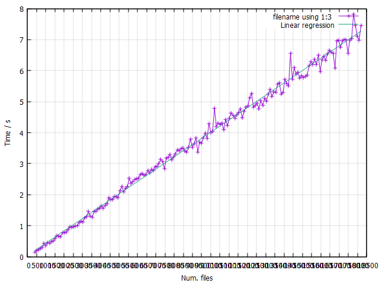

# MinIO WalkDir Debugging

This code is the WalkDir algorithm ripped out from MinIO's ListObject
logic. Changes had to be made to get this code to compile. I sadly
started versioning too late, otherwise it could have been even clearer
which parts of the code I had to change.

The tool will **only work on MinIO buckets**. It will recurse on other
paths as well, but the algorithm is designed for `xl.meta` files and
`__XLDIR__` directories and will not count other files or directories
properly.

The tool outputs a CSV line, e.g.

```bash
$ ./walkdir /path/to/minio/bucket
# Number of files; Total duration
209394;1.854680
```

## Building

```bash
go build -o walkdir
```

## Run the measurement

```bash
# Register an alias
mc alias set nasxl https://localhost:9000 <accesskey> <secretkey>

# Create an empty bucket
mc mb nasxl/test20000

./measure-openFileNolog.sh nasxl/test20000 1 400 50 /gluster/repositories/<repo>/<space>/test20000
```

## Plot the results with GnuPlot

```bash
gnuplot -e "filename='/path/to/output.csv'" ./plot.plt
```

The resulting plot should look like this:



## FAQ

### Where does the code come from?

All over the place. If you want to compare it to MinIO it's best to search
for a line of code directly.

The code could be cleaned up heavily, but I opted not to do so to retain
the highest amount of similarity to the original code.

### What state is this based on?

I used commit
[34e35c3](https://github.com/iternity-dotcom/minio/commit/34e35c366fff7b7e598b26d1fd7227f7ab4f135f)
as a basis, which at that time was the latest commit on the
[iternity-rb branch](https://github.com/iternity-dotcom/minio/tree/iternity-rb)

### What about the Goroutines that were there?

I commented all of them out, because the code runs synchronously anyway.
I've kept them in place, but I don't think that it should affect the
runtime significantly.

I also ran into some trouble where the code would either return an
incorrect count or deadlock. The deadlock occurred because the main
routine was waiting for a separate counting Goroutine. The counting
routine blocked and waited for input from the channel and would not
unblock, even when the channel was closed.

Rather than fixing this, I opted to comment out the code and do
everything synchronously.

### What about error handling?

MinIO implements it's own logger. To not pollute the very specific csv
output of the tool I simply commented out all places where the logger was
used.

Error messages should still be returned as expected everywhere, except in
`WalkDir()` where any critical error should cause a panic.

### I see you commented out the sync code? What about that?

Yeah, I don't think we need that. We're running the code synchronously in
one instance. No Goroutines are involved, so there's no need to
synchronize anything. I mainly chose to comment this out, because it saved
me from having to copy more code over.
